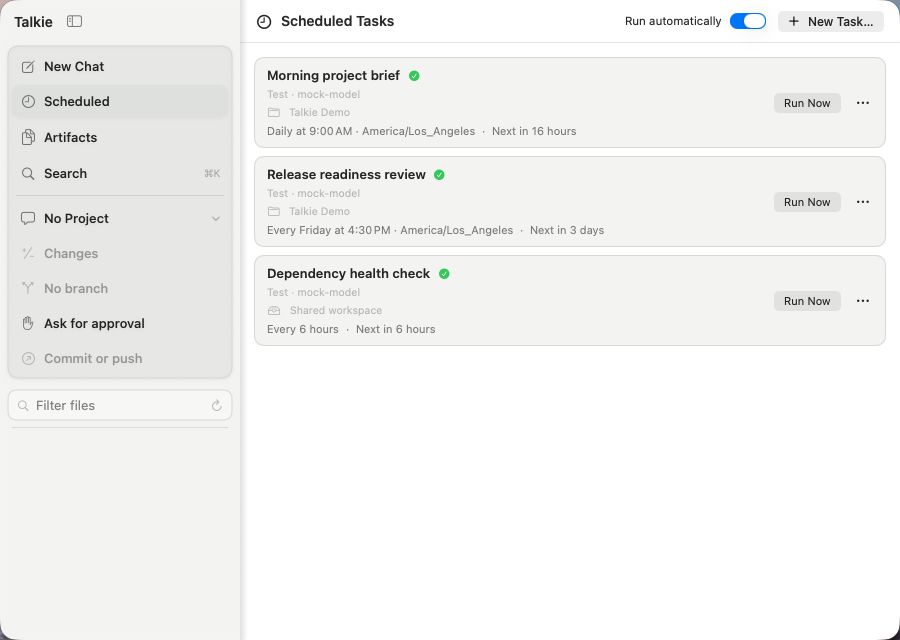
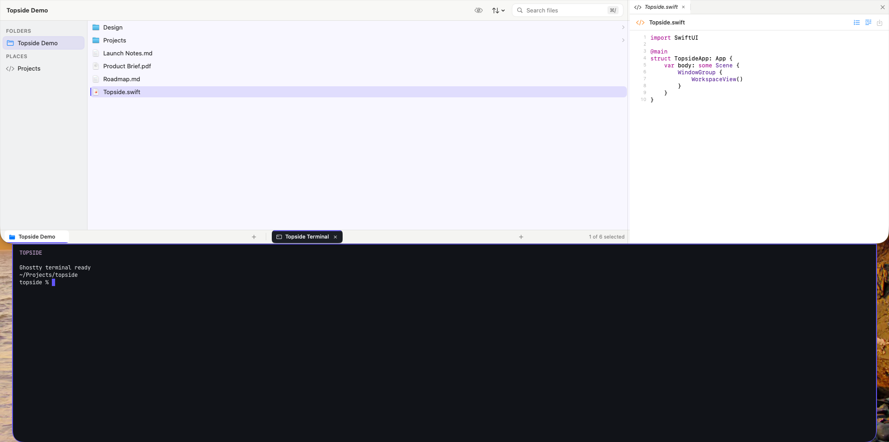
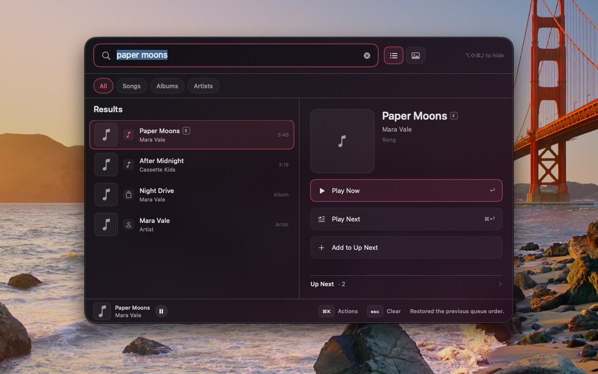

Most "AI app" projects are a chat window over someone else's API. This is the other
thing: a set of macOS applications that each do one job well, share a common
substrate, and compose into an assistant that runs on hardware I own.

The parts talk to each other on purpose. Topside publishes file search; Talkie
consumes it as a tool. Talkie pushes conversation memory into Windex and queries it
back as a retrieval source. The Talkie session protocol serves the Mac UI, an iOS
companion, a Safari extension, and — currently in progress — Muzick. **The seams are
the interesting part.**

Roughly 200k lines of Swift across four apps, a 90k-line Python retrieval backend,
and about 2,800 tests.

> Talkie, Topside, and Muzick are private repositories. LocalMCPKit and Windex are
> public and linked below.

---

## Talkie — the agent workspace

A native macOS AI workspace in Swift 6 and SwiftUI. Multi-provider chat — native
Anthropic, OpenAI-compatible endpoints, Ollama, llama.cpp, LM Studio, OpenRouter —
where each conversation pins its own provider, model, instructions, and reasoning
mode.

Underneath is a streamed agentic tool loop with bounded multi-round execution,
approval-gated command execution, expandable activity, and change review. Nine
plugin families extend it: project-scoped code tools, an MCP client, deep research,
subagents, web search, memory, Safari tabs, local services, and retrieval sources.

Scheduled agents run one-time, repeating, daily, or weekly prompts. Each keeps an
exact model, an IANA time zone, a dedicated conversation, and an optional working
project. If that project's folder goes away — an external drive detaches — the task
is **visibly blocked** rather than silently running somewhere else, and resumes when
the folder returns.

Conversations and app state are readable local JSON. Provider credentials live in the
macOS Keychain.

## The session protocol — one authority, many surfaces

The piece I am proudest of, and the one with no screenshot.

A transport-neutral Swift package makes a single Mac authoritative for every client.
It has three ideas worth naming:

**Negotiated versions.** Client and server exchange version *ranges* and settle on the
highest mutually supported protocol. Old clients keep working; new ones get more.

**Revision-stamped projections.** Every resource — a conversation, the scheduled-task
collection, artifacts, approvals, a change-review scope — carries a monotonic revision.
Clients reconcile against a revision rather than re-fetching the world, and a command
can declare the revision it expected so a stale write is rejected instead of clobbering.

**A durable command journal.** A write-ahead reservation reaches disk *before* the
command mutates state. A crash can therefore produce an indeterminate retry — but it
can never execute the same command twice. That property is what makes a flaky phone
connection safe to retry.

Around those: Bonjour discovery, per-device TLS identity, and capability-scoped grants
issued through a commitment exchange that shows a matching verification code on both
devices.

## Four clients, no server-side special-casing

The protocol earns its keep by how cheap a new surface is.

The **iOS companion** discovers the Mac over Bonjour on a LAN, or connects directly on
a stable port over Tailscale from anywhere. Pairing requires an explicit approval on
the Mac with a matching code. Once paired, it drives full conversations, scheduled
tasks, artifacts, change review, and approval prompts remotely — the phone is a real
client, not a notification mirror.

The **Safari extension** — a web extension plus a native handler — hands live page
content to the desktop agent.

**Muzick** is the fourth, in progress. Adding it is a client, not a protocol change,
which is the entire point of having built the protocol first.

## Topside — the file substrate

A keyboard-first file workspace that drops from the top of the screen over whatever
you were doing. A persistent SQLite index over folders you explicitly choose, with
background refresh. Miller columns for deep navigation that keeps the path visible. A
tabbed work pane for text, source, Markdown, PDF, and Quick Look. And a real terminal
— every tab owns a persistent [Ghostty](https://ghostty.org) surface and login shell,
with bundled terminfo and shell integration.

For the platform, its job is to be a **producer**: Topside publishes `files.folders`
and `files.search` to approved apps over LocalMCPKit. The tool surface is deliberately
narrow — stable metadata only, no file contents, no open/reveal/delete/move, no
arbitrary paths. Pairing never defaults to allow; the requesting identity and a
four-character verification code are shown, and every grant is revocable on its own.

Topside is intentionally not sandboxed, and the reason is written down: a child login
shell inherits its parent's sandbox and cannot use the app's security-scoped file
grants. In exchange, terminal clipboard reads and writes over OSC 52 are denied,
protected paste requires confirmation, and closing a terminal with a foreground job
asks first.

## LocalMCPKit — the secure local transport

**[github.com/stevemurr/local-mcp-kit](https://github.com/stevemurr/local-mcp-kit)** ·
Swift 6 · zero dependencies

One macOS app publishes typed, schema-validated commands as a Model Context Protocol
endpoint. Another app on the same Mac discovers it, pairs with explicit user approval,
and calls them.

It runs the full MCP 2025-11-25 lifecycle, but carries every message inside an
encrypted loopback envelope: X25519 key agreement, HKDF-SHA256, ChaCha20-Poly1305. The
bearer token, session and protocol headers, and the JSON-RPC body never appear on the
outer wire. The listener binds numeric `127.0.0.1` only, and Bonjour registration,
browsing, and resolution are restricted to `LocalOnly`. Nothing leaves the machine.

Two design positions I would defend in review:

- **Discovery is availability, not trust.** A saved grant is never sent automatically
  to a replacement producer instance. Re-pairing is always explicit.
- **Pairing is channel-bound.** A commitment → challenge → reveal exchange binds the
  grant to the exact producer instance *and its key*, so a look-alike endpoint cannot
  inherit an approval.

The test suite is adversarial by design — tamper, replay, response-swap,
key-substitution, and rotation failures — against deterministic in-memory transports,
clocks, and randomness.

## Windex — the retrieval backend

**[github.com/stevemurr/windex](https://github.com/stevemurr/windex)** · Python ·
REST + MCP

A search index for agents, on your hardware. Around 16.1M documents from nine public
sources — CC-News, GitHub project metadata, Wikipedia, arXiv, Hacker News, the small
web, DevDocs, Hugging Face docs — plus one source that is *pushed* rather than pulled:
conversation memory from Talkie. 6.75M documents embedded at 4096 dimensions across
per-source Qdrant collections behind aliases, with dense and BM25 legs fused by
reciprocal rank fusion.

The parts that took real thought:

**Dedup in two tiers.** An exact canonical-URL and content-hash ledger, plus MinHash
LSH over a rolling window to collapse cross-day wire syndication.

**Vectors are derivable.** Extracted text and embeddings persist to parquet, so
swapping embedding models or recovering from index corruption is a re-embed and an
alias flip — never a re-crawl. Model choice is config, not code.

**Freshness is one pattern, repeated.** Every source uses the same loop: a watermark
table finds new upstream work, idempotent batches catch up, a daily job keeps current.
Backfill and incremental refresh are the same code path.

**Degradation is honest.** Under heavy indexing load, hybrid queries fall back to
keyword search after a deadline rather than stalling — and the response says so.

### The reranker that didn't ship

I built the eval harness the index is tuned against: a known-item leg, a golden leg of
91 hand-built anchors across seven sources, and an LLM-judge leg, reporting
NDCG/MRR/Recall/Precision at *k*.

Then I trialed a cross-encoder reranker, because RRF scores are rank-reciprocals and
aren't comparable across collections. With rerank on, some documents scored a spurious
~1.0 and outranked the right answer — a CSS fragment beating an on-topic result. I
traced it to a caller-side prompt-format bug, fixed it, and measured again.

It still lost. Rerank is off, by decision, backed by data — and the disproven
hypotheses are written down so the same ground doesn't get re-covered. Shipping the
negative result *is* the result.

## Muzick — the fourth surface

A keyboard-first command palette for Apple Music. SwiftUI hosted in a key-capable
accessory `NSPanel`, summoned by a configurable global hot-key through Carbon's
exclusive API. MusicKit's `ApplicationMusicPlayer` for an app-owned playback session,
SwiftData for local history and a deliberately separate saved library.

Its scope is defined by what it refuses to do: it doesn't browse or modify your Apple
Music library, doesn't touch Music.app's queue, and has no "View in Apple Music"
link-outs. It owns its session and stays out of the way.

It is currently gaining a Talkie session surface — the fourth client on the protocol.

## How it's tested

A practice shared across all four macOS apps, worth stating because it is easy to get
wrong: **XCUITest bundles never run on the host.** macOS UI tests seize the keyboard
and pointer of whatever machine they run on. Every app delegates its UI suite to a
disposable [Tart](https://tart.run) VM through a shared runner that returns an
`.xcresult` bundle with screenshots and diagnostics.

That constraint pushed a useful design: each app composes deterministic offline
services, so the whole thing runs hermetically in a clean VM with no network. Every
screenshot on this page was captured there.

Release qualification is scripted too — bundle identity and versions, app icons,
privacy manifests, entitlements, signature integrity, Hardened Runtime, and exclusion
of test fixtures.
