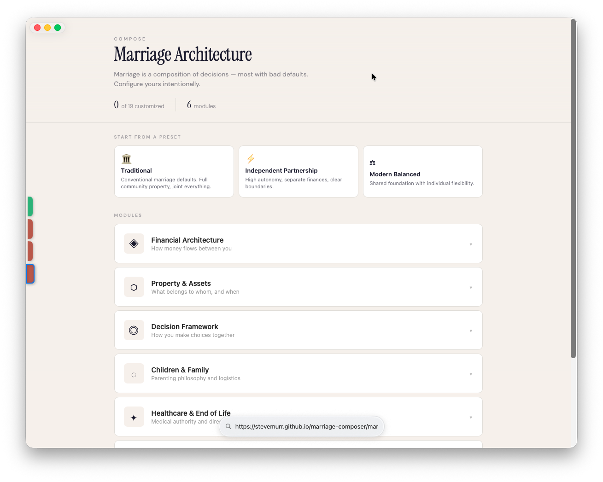
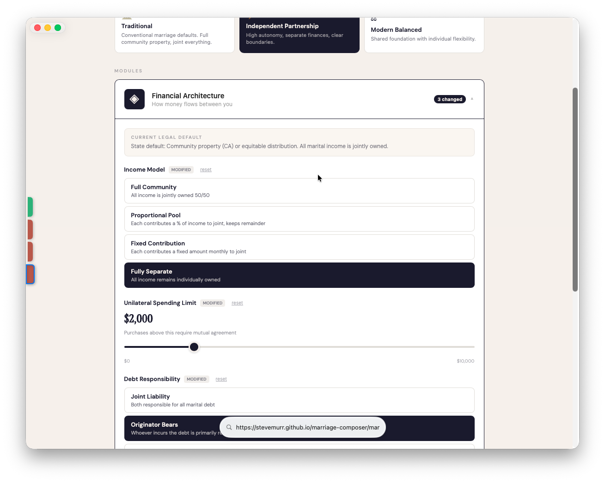
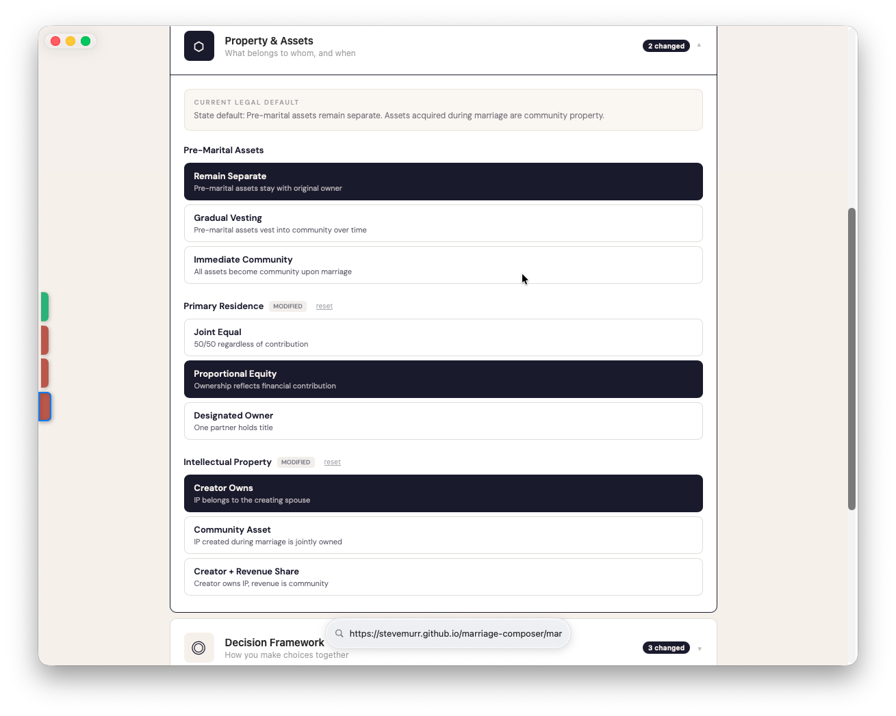
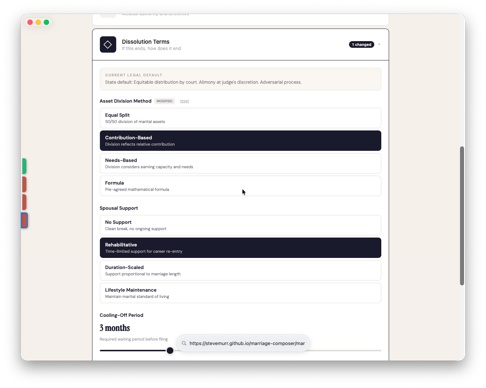

<!--
BLOG POST 1: Marriage Has Default Settings
Series: Composable Marriage
Audience: builders and product-minded readers
Tone: provocative, concrete, systems-oriented
-->

> **Try the prototype:** [Marriage Composer](https://stevemurr.github.io/marriage-composer/marriage-composer/) -- configure a marriage like infrastructure instead of accepting defaults you've never read.



# Two People Want to Get Married

Imagine two people decide to get married.

They do the whole thing. Pick the venue. Fight about the guest list. Taste seven different cakes and pretend they can tell the difference. Choose colors, flowers, a DJ who will definitely play Mr. Brightside whether anyone asks for it or not.

At no point during this process does anyone hand them a document that says: *"Here is what you just agreed to about income, debt, property, medical decisions, inheritance, and what happens if this ends."*

They said "I do." What they actually did was accept a terms of service they never read.

## ***What did they actually sign up for?***

Let's walk through it. Our couple lives in California -- a community property state. This matters a lot because the defaults here are especially aggressive about what becomes shared.

**Income.** Starting the day they get married, every dollar either of them earns belongs to both of them equally. Doesn't matter whose job it came from, whose name is on the check, or who worked harder that year. If one person earns $300k and the other earns $40k, the legal system treats all of it as community property.

Most couples vaguely know this. What they don't know is how far it reaches.

**Debt.** She has $80k in student loans from before the marriage. Those stay separate -- they're premarital debt. But if she refinances those loans during the marriage? There's an argument that the new debt is community debt. He didn't sign up for that. He didn't even know she was refinancing.

**Retirement.** He's been contributing to a 401k for ten years before they met. The balance on their wedding day is his separate property. But every contribution he makes *after* the wedding? Community property. Every dollar of employer match? Community property. The growth on those post-wedding contributions? Also community. He assumes his retirement account is "his." It partially is. Partially isn't. The line is blurry and expensive to untangle.

**The house.** They buy a house together, but she puts up the entire down payment from savings she had before the marriage. They both pay the mortgage from their community income. If they divorce, is she getting her down payment back? Maybe. Maybe not. It depends on whether she can trace the funds and whether commingling turned her separate property into community property.

**Medical decisions.** One of them is in a car accident and unconscious. Who makes medical decisions? The spouse, right? Usually. But what if his parents challenge it? What if they disagree about end-of-life care and there's no healthcare directive? The answer is: it goes to court. While one of them is in a coma.

**What "fair" means.** Neither of them has discussed what happens if this ends. Not because they're avoiding it -- because it feels morbid. Like planning for failure. So they don't talk about spousal support, how to split the house, who keeps the dog, or whether they'd try mediation before hiring lawyers. They'll "figure it out later." Later is a courtroom.

None of this is hidden. It's all in the California Family Code. But nobody reads the California Family Code before their wedding. They read The Knot.

***

# The Product Problem

Here's the thing that bothers me about this.

If marriage were a product -- an actual software product with a settings page -- it would be the worst-designed product in history.

It ships with aggressive defaults that most users don't understand. There's no onboarding flow. There's no "review your settings before you commit" screen. The documentation exists but it's written in legalese and scattered across state statutes. And the only time most users discover their configuration is during the worst moment of their lives -- divorce proceedings, a medical emergency, or someone's death.

This is a bad product because the user commits before they see the settings.

> *"but prenups exist"*

Yeah. And prenups are better than nothing. But the way most people encounter prenups is adversarial. One partner brings it up, the other feels hurt, and the conversation immediately becomes about trust instead of configuration.

The question shouldn't be "do you trust me enough to not need a prenup?"

The question should be "which defaults fit this specific partnership?"

***

# The Composable Alternative

What if instead of one big adversarial document, you had a set of independent choices you could make together? Not a prenup negotiation. A configuration session.

Here's what that might look like for our couple:

```
income_model        = proportional_pool
home_ownership      = proportional_equity
debt_treatment      = originator_bears
medical_poa         = spouse_with_backup
dispute_resolution  = mediation_first
```

Each of these is a decision. Each one has a default (set by the state) and each one can be explicitly configured (by the couple). Let's break them down:

**`income_model = proportional_pool`** -- They don't want fully separate finances, but they also don't want the state's "everything is 50/50" default. They agree to pool a proportional percentage of income into a shared account. The rest stays individual.

**`home_ownership = proportional_equity`** -- She put up the down payment. They both pay the mortgage. Ownership tracks contribution. If they sell, she gets her down payment back first, then proceeds split proportionally. No commingling ambiguity.

**`debt_treatment = originator_bears`** -- Premarital debt stays with whoever brought it. Debts incurred during the marriage require mutual agreement to be treated as shared. Her student loan refinance is her call, but it stays her debt.

**`medical_poa = spouse_with_backup`** -- Spouse is the primary medical decision-maker. If the spouse is unavailable or incapacitated, a named backup (sibling, parent, friend) steps in. No courtroom needed.

**`dispute_resolution = mediation_first`** -- Before anyone hires a lawyer, they agree to try mediation. If mediation fails, then arbitration. Litigation is the last resort, not the first.

Each of these is a product decision before it becomes a legal document. And none of them require the conversation to be about trust. They're about preferences.



A founder with pre-marital equity and IP might configure things differently:

```
income_model    = separate
ip_ownership    = creator
home_ownership  = proportional_equity
```

A dual-income couple with no assets might go simpler:

```
income_model        = full_pool
debt_treatment      = shared
dispute_resolution  = collaborative_law
```

The point isn't that there's one right configuration. The point is that the configuration should be explicit and chosen, not hidden and defaulted.



***

# The Prototype

This isn't just a blog post thought experiment. There's a working prototype that models this.

The [`marriage-composer.jsx`](https://github.com/stevemurr/marriage-composer/blob/main/marriage-composer.jsx) UI is built around a `MODULES` structure that treats marriage as six independent but related domains:

| Module          | What It Covers                                      |
| --------------- | --------------------------------------------------- |
| **finances**    | Income pooling, separate vs. shared accounts        |
| **property**    | Ownership, title holding, equity tracking           |
| **decisions**   | Dispute resolution, relocation, major life choices  |
| **children**    | Custody frameworks, education, religious upbringing |
| **health**      | Healthcare directives, medical POA, HIPAA access    |
| **dissolution** | Exit terms, support frameworks, cooling periods     |

The prototype ships with presets -- think of them like starter configs. The `Independent Partnership` preset is the most relevant one for people who want explicit boundaries:

* Separate income

* Creator-owned IP

* Proportional equity

* Originator bears debt

* Arbitration for disputes

But you can mix and match. Take a preset as a starting point, then adjust individual settings to fit your actual partnership.

The insight here is structural: marriage can be represented as a set of independent, composable decisions. The repo is not a mockup of screens. It is a working argument that these decisions can be modeled, configured, and eventually compiled into legal documents.



***

# What This Cannot Solve

Let me be clear about the boundaries.

**It cannot make a one-sided agreement enforceable.** If the configuration is wildly unfair to one partner, a court will throw it out. California requires both parties to have independent legal counsel, full financial disclosure, and voluntary consent. No amount of software changes that.

**It cannot replace attorney involvement.** In California, a prenup is unenforceable if both parties didn't have the opportunity to consult independent attorneys. The tool can structure the conversation and generate draft documents, but a human lawyer still needs to review and sign off.

**It cannot pre-decide child custody.** Courts make custody decisions based on the best interest of the child at the time of the dispute, not based on what the parents agreed to before the kid existed. You can express preferences, but a judge isn't bound by them.

**It cannot skip financial disclosure.** Both parties need to fully disclose their finances. A prenup signed without disclosure is challengeable and probably unenforceable.

Software can expose the settings, structure the conversation, and compile documents. It cannot abolish the legal system. And it shouldn't -- the legal system exists to protect the person with less power in the relationship. The goal is to make the system legible, not to bypass it.

***

# What's Next

Even if you make every choice about income, property, and disputes explicit -- the most important decision you will make is in choosing the right partner.

Real talk - therapy is one part of the puzzle. But the reality is in order to grow you have to be able to look at yourself and debug that shit. Like RuPaul says --

> The call is coming from inside the house.
