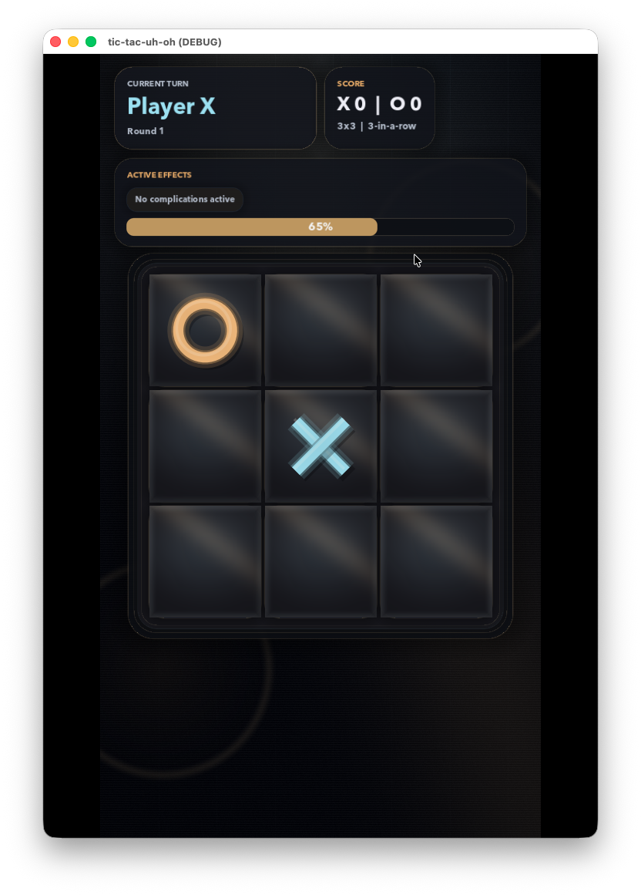
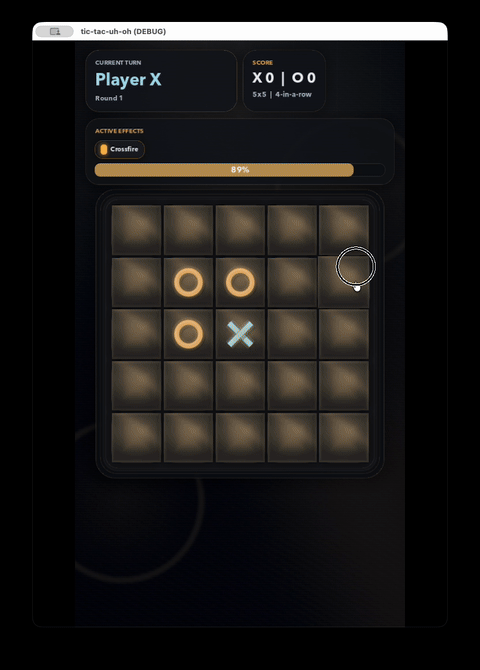

## The Basic Idea

Tic Tac Toe.

It's a game of wits... 
It's a game of of cunning... 

Oh wait nevermind this shits pretty dumb.

Tic Tac Toe is pretty lame when you think about it. But why is it lame? Lame quotient is in the eye of the beholder but I'm going to go with the theory of complexity and novelty. The skill ceiling to tic tac toe is just really fucking low. Play it a few times and you develop a near perfect algorithm for optimal play. Optimal play leads to draws though. 

Is a draw fun? I think it depends on your own degrees of narcicissm and dopamine seeking tendencies. If you are a "competetive" person who must "own" people then yeah a draw is like blue balls or getting kicked in the nuts. 

Others might be more tuned for delayed satisfaction and a draw is simply the ending to a game well-played by both sides. 

What if you could satisfy both sides of this equation? Satisfy the massochistic narcicists and the emotionally intelligent panzies?

So if a draw is a common outcome then make draws part of the expected path of gameplay. In this experiment, when you draw, a complication and/or spatial mixup get introduced.

## Escalations

### Complications

Complications change how the game plays. They're rule mutations -- here's an example:

Crossfire -- when you place a mark, it blasts in all four cardinal directions and converts every opponent mark in its path until it hits a wall or the edge of the board. One well-placed move can flip an entire row and column.

Gravity -- marks don't just sit where you place them. They fall to the lowest empty cell in the column, like dropping a chip in Connect Four. It completely changes how you think about placement because you can't just grab any open spot -- you have to account for where your mark will actually land.

### Spatial Mixups

Spatial mixups are different. They don't change the rules -- they rearrange the board. When a draw happens and the board grows, a random mixup fires and scrambles existing marks into new positions. One might shuffle every mark to a random spot. Another does a vortex thing where marks in concentric rings rotate in opposite directions. There's a plinko one that nudges marks in random cardinal directions until they hit something.

The point is that any position you were building toward before the draw? Gone. You have to re-evaluate the entire board and figure out your strategy from scratch. Combined with whatever new complication just got added, it keeps things from ever feeling stale.

## Inspirations

The inspiration came from one of my favorite spatial puzzle games on the oculus. To be honest - I can't remember the name of the game. But I could get lost in the game for hours just solving the 3D puzzles. And the puzzles became more and more complex as you progressed through the levels. 

That feeling + seeing the rise of run based games like slay the spire and balatro made me say - Fuck It - lets try it out. 

## Early Thoughts

I grew up playing video games. I love video games. I still play them. So the first time I loaded it up and "played" it was kind of a thrill to be honest. The idea that I can craft that interaction loop between the game and player to EXACTLY what I like gives me a brain-boner.
