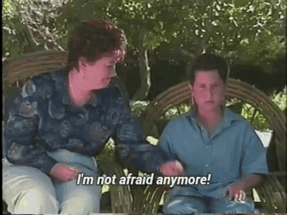
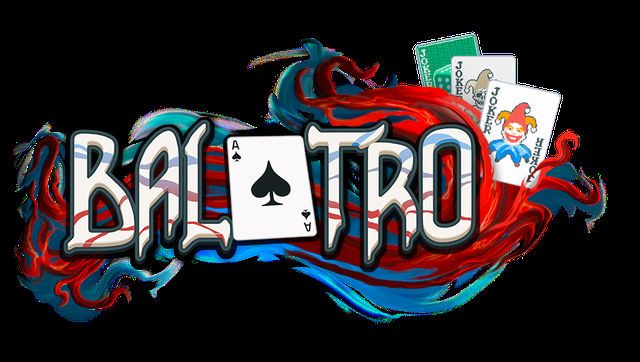

# The Basic Idea

Tic Tac Toe ...  
It's a game of wits...   
It's a game of of cunning...   

**oh wait nm this shits pretty dumb**


Tic Tac Toe is pretty lame when you think about it. 

## ***But why is it lame?***

Lame quotient is in the eye of the beholder but I'm going to go with the theory of complexity and novelty. The skill ceiling to tic tac toe is just really fucking low. Play it a few times and you develop a near perfect algorithm for optimal play. Optimal play leads to draws though. 

## ***Is a draw fun though?*** 

It depends on factors like if you suffer from narcicissm and dopamine seeking tendencies. 

If you're a *"competetive"* person who must *"own"* people then yeah -- a draw is like getting kicked in the nuts. 

If you're tuned for delayed gratification and a draw is simply the ending to a game well-played by both sides. 

Is it possible to satisfy both the massochistic narcicists and the emotionally intelligent panzies?

## ***I think you totally can***

You do this by admitting to yourself that you are operating from a place of fear. Once you operate from a place of love you will finally admit the truth --



### ***A DRAW IS A feature AND NOT A bug***

I can hear you now. 

>*"ur preachin to the choir bruh. but how u finna gonna do dat?"* 

To that I say --

>*"don't trip cuz."*

We do that by making the game harder. We make the game harder via 1) **Complications** and 2) **Spatial Mixups**.

# Complications

Complications change how the game plays by mutating the rules. For example --

### CROSSFIRE

When you place a mark, it blasts in all four cardinal directions and converts every opponent mark in its path until it hits a wall or the edge of the board. One well-placed move can flip an entire row and column.


---

### GRAVITY

Marks don't just sit where you place them. They fall to the lowest empty cell in the column, like dropping a chip in **Connect Four**. It completely changes how you think about placement because you can't just grab any open spot -- you have to account for where your mark will actually land.


---

# Spatial Mixups

Spatial mixups are different. They don't change the rules -- they rearrange the board. 

When a draw happens and the board grows, a random mixup fires and scrambles existing marks into new positions. One might shuffle every mark to a random spot. Another does a vortex thing where marks in concentric rings rotate in opposite directions. There's a plinko one that nudges marks in random cardinal directions until they hit something.

The point is that any position you were building toward before the draw? Gone. You have to re-evaluate the entire board and figure out your strategy from scratch. Combined with whatever new complication just got added, it keeps things from ever feeling stale.

# Inspirations

The first inspiration came sometime in 2014. This is gonna sound really boring but I was reading the `numpy` docs. I had fun playing around with all the ways you could transform matrices. For example --

### Transpose

Transpose flips a matrix along its diagonal. This of it like:
- Rows become columns
- Columns become rows

```python
import numpy as np

matrix = np.array([[1, 2, 3],
                   [4, 5, 6]])

print("Original (2×3):")
print(matrix)
# [[1 2 3]
#  [4 5 6]]

print("\nTransposed (3×2):")
print(matrix.T)
# [[1 4]
#  [2 5]
#  [3 6]]

```

### Flip

Flip is like mirroring your matrix. You can do an `original` flip, `horizontal` flip or a `vertical` flip.

```python
matrix = np.array([[1, 2, 3],
                   [4, 5, 6]])

print("Original:")
print(matrix)
# [[1 2 3]
#  [4 5 6]]

print("\nFlip horizontally:")
print(np.fliplr(matrix))
# [[3 2 1]
#  [6 5 4]]

print("\nFlip vertically:")
print(np.flipud(matrix))
# [[4 5 6]
#  [1 2 3]]
```

### Extract Diagonal

Extract diagonal pulls out the *main diagonal* -- the line of elements going from top-left to bottom-right.

```python
matrix = np.array([[1, 2, 3],
                   [4, 5, 6],
                   [7, 8, 9]])

print("Original matrix:")
print(matrix)

print("\nDiagonal:")
print(np.diag(matrix))
# [1 5 9]

print("\nCreate matrix from diagonal:")
print(np.diag([1, 5, 9]))
# [[1 0 0]
#  [0 5 0]
#  [0 0 9]]
```

## Balatro



Balatro is a cool game. It proved that you can just take an existing game and mechanics and mix it with some roguelite elements and make something fun and new. 


## Coding Agents

Making a game is a lot of work. Coding agents are like cocaine for creative people. Don't take my word for it - look at my github activity. 

# Early Thoughts

I grew up playing video games.   
I love video games. 

The first time I loaded it up and "played" it was kind of a thrill to be honest. The idea that I can craft that interaction loop between the game and player to EXACTLY what I like gives me serious brain-boner.
